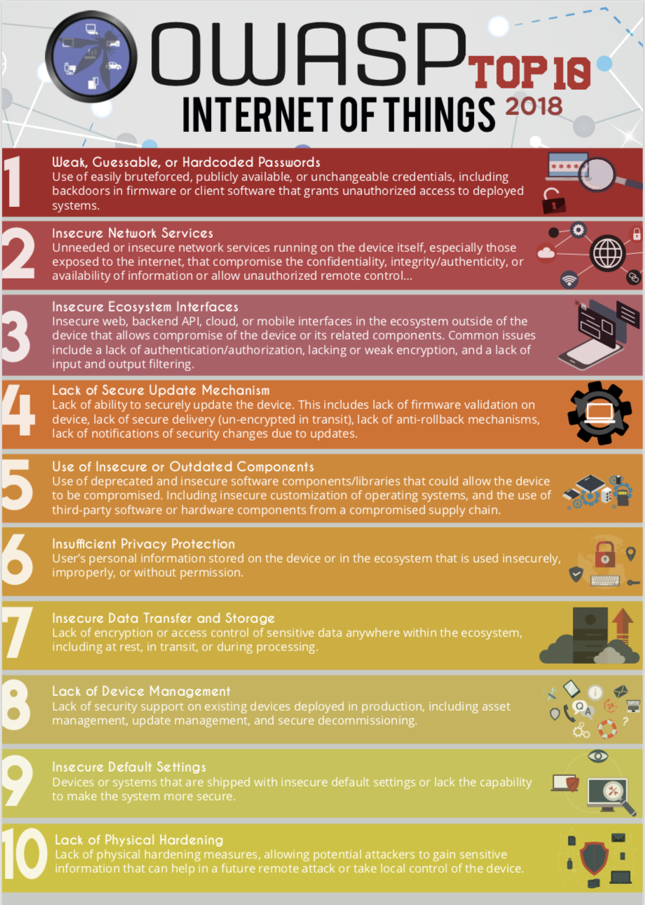

# OWASP IoT Top 10 2018 Mapping Project

The [OWASP IoT Mapping Project](https://www.owasp.org/index.php/OWASP_Internet_of_Things_Project#tab=OWASP_IoT_Top_10_2018_Mapping_Project) is intended to provide a mapping of the OWASP IoT Top 10 2018 to industry publications and sister projects. The goal is to provide resources that enable practical uses for the OWASP IoT Top 10 . As with all Top 10 lists, they should be used as a first step and expanded upon according to the applicable IoT ecosystem. 

Mappings are structured with control categories, tests, or recommendations in the left column, descriptions in the middle column, and their mapping to the OWASP IoT Top 10 2018 list in the right column. Each mapping may not have a 1 to 1 relation; however, similar recommendations and/or controls are listed. For mappings that are not applicable to the IoT Top 10 2018 list, an "N/A" is provided as the mapping.

## OWASP IoT Top 10 2018

| [OWASP IoT Top 10 2018](https://www.owasp.org/images/1/1c/OWASP-IoT-Top-10-2018-final.pdf) | Description |
| :--- | :--- |
| I1 Weak, Guessable, or Hardcoded Passwords | Use of easily bruteforced, publicly available, or unchangeable credentials, including backdoors in firmware or client software that grants unauthorized access to deployed systems. |
| I2 Insecure Network Services | Unneeded or insecure network services running on the device itself, especially those exposed to the internet, that compromise the confidentiality, integrity/authenticity, or availability of information or allow unauthorized remote control. |
| I3 Insecure Ecosystem Interfaces | Insecure web, backend API, cloud, or mobile interfaces in the ecosystem outside of the device that allows compromise of the device or its related components. Common issues include a lack of authentication/authorization, lacking or weak encryption, and a lack of input and output filtering. |
| I4 Lack of Secure Update Mechanism | Lack of ability to securely update the device. This includes lack of firmware validation on device, lack of secure delivery \(un-encrypted in transit\), lack of anti-rollback mechanisms, and lack of notifications of security changes due to updates. |
| I5 Use of Insecure or Outdated Components | Use of deprecated or insecure software components/libraries that could allow the device to be compromised. This includes insecure customization of operating system platforms, and the use of third-party software or hardware components from a compromised supply chain |
| I6 Insufficient Privacy Protection | User’s personal information stored on the device or in the ecosystem that is used insecurely, improperly, or without permission. |
| I7 Insecure Data Transfer and Storage | Lack of encryption or access control of sensitive data anywhere within the ecosystem, including at rest, in transit, or during processing |
| I8 Lack of Device Management | Lack of security support on devices deployed in production, including asset management, update management, secure decommissioning, systems monitoring, and response capabilities. |
| I9 Insecure Default Settings | Devices or systems shipped with insecure default settings or lack the ability to make the system more secure by restricting operators from modifying configurations. |
| I10 Lack of Physical Hardening | Lack of physical hardening measures, allowing potential attackers to gain sensitive information that can help in a future remote attack or take local control of the device. |

## Contributing

If a crucial mapping is missing or edits should be made, feel free to contribute by submitting a pull request, contact the project leaders, or join the [OWASP Slack Team](https://owasp.slack.com/) and look for us in the \#iot-security channel. 

